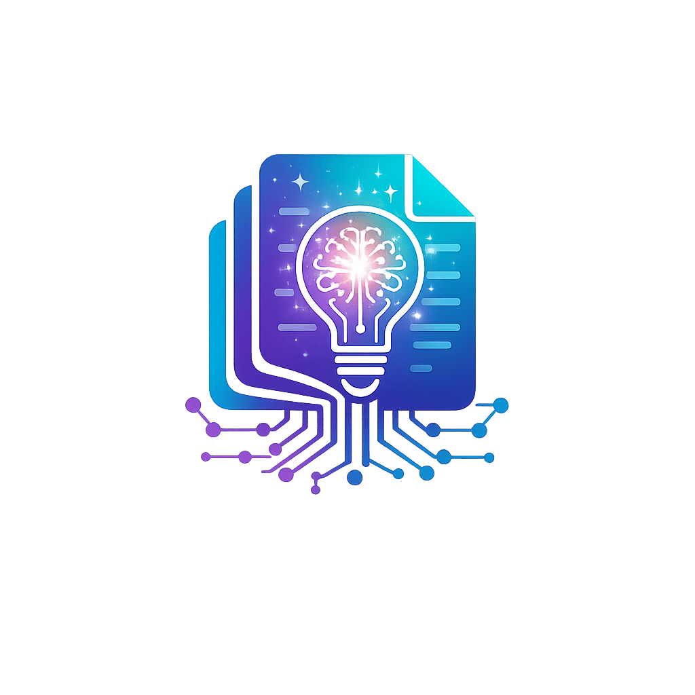

<div align="center">



# RAGify

[](https://www.nuget.org/packages/RAGify)
[](https://dotnet.microsoft.com/download)
[](LICENSE)
[]()

Build powerful RAG applications in .NET with ease. RAGify is a modular, production-ready framework that simplifies document ingestion, intelligent chunking, vector embeddings, and semantic search. Switch between 8+ embedding providers, customize chunking strategies, and scale from prototype to production—all with a clean, intuitive API.

</div>

## 📋 Table of Contents

- [Features](#-features)
- [Installation](#-installation)
- [Quick Start](#-quick-start)
- [Documentation](#-documentation)
- [Architecture](#-architecture)
- [Supported Providers](#-supported-providers)
- [Configuration](#-configuration)
- [Examples](#-examples)
- [Extending RAGify](#-extending-ragify)
- [Best Practices](#-best-practices)
- [Performance Considerations](#-performance-considerations)
- [Troubleshooting](#-troubleshooting)
- [Contributing](#-contributing)
- [License](#-license)

## ✨ Features

### 🗂️ Document Ingestion
- **Multi-format Support**: PDF, Word (.docx), Excel (.xlsx), HTML, and plain text files
- **Automatic Format Detection**: File type detection based on extension
- **Stream Support**: Ingest from files, streams, or raw text
- **Metadata Management**: Attach and track custom metadata
- **Batch Processing**: Efficient batch ingestion operations
- **Extensible Extractors**: Easy to add support for new file formats

### ✂️ Flexible Chunking Strategies
- **Fixed Size**: Simple character-based chunking with configurable overlap
- **Sentence-Aware**: Respects sentence boundaries for better semantic coherence
- **Sliding Window**: Overlapping chunks for improved context preservation
- **Configurable Parameters**: Fine-tune chunk size, overlap, and boundary handling
- **Extensible Design**: Implement custom chunking strategies via interfaces

### 🔢 Embedding Providers
RAGify supports **8 production-ready embedding providers**:

| Provider | Models | Use Case |
|----------|--------|----------|
| **OpenAI** | text-embedding-ada-002, text-embedding-3-small, text-embedding-3-large | Production applications, high accuracy |
| **Azure OpenAI** | All OpenAI models via Azure | Enterprise deployments, compliance |
| **Ollama** | nomic-embed-text, all-minilm, and 100+ models | Local development, privacy-sensitive |
| **ONNX/SentenceTransformer** | Any ONNX-compatible model | Offline inference, cost optimization |
| **Hugging Face** | 1000+ models via Inference API | Research, experimentation |
| **Cohere** | embed-english-v3.0, embed-multilingual-v3.0 | Multilingual applications |
| **VoyageAI** | voyage-large-2, voyage-2, voyage-code-2 | Code embeddings, specialized tasks |
| **Google Gemini** | text-embedding-004, multilingual models | Google Cloud integrations |

**Key Capabilities**:
- Provider-agnostic interface for easy switching
- Async-first design with batch support
- Automatic vector normalization
- Configurable dimensions and model parameters
- Comprehensive error handling

### 💾 Vector Storage
RAGify supports **5 production-ready vector stores**:

| Store | Type | Best For | Production Ready |
|-------|------|----------|------------------|
| **In-Memory** | Local | Development, testing, small datasets (< 100K vectors) | ✅ |
| **Qdrant** | Open-source | High-performance, self-hosted, cost-efficient | ✅ |
| **PgVector** | PostgreSQL Extension | Existing PostgreSQL infrastructure, small-medium datasets | ✅ |
| **Pinecone** | Managed Cloud | Fully managed, serverless, auto-scaling | ✅ |
| **Weaviate** | Open-source/Cloud | Hybrid search, flexible schema, multi-modal | ✅ |

**Key Capabilities**:
- **In-Memory Store**: Fast, thread-safe store for development and testing
- **Interface-Based Design**: Easy integration with any vector database
- **Advanced Search**: Cosine similarity with metadata filtering
- **Top-K Retrieval**: Configurable result limits and similarity thresholds
- **Batch Operations**: Efficient bulk upsert and delete operations
- **Configurable Queries**: Customize SQL queries for PgVector (production-ready)

### 🔍 Retrieval Engine
- **Query Embedding**: Automatic query-to-vector conversion
- **Similarity Search**: Ranked results with similarity scores
- **Metadata Filtering**: Filter results by custom metadata
- **Performance Optimized**: Caching and efficient algorithms

### 🎯 RAGify
- **Fluent API**: Intuitive builder pattern for configuration
- **High-Level Interface**: Simple API hiding complexity
- **Advanced Customization**: Full control when needed
- **Production Ready**: Built for scalability and reliability

## 📦 Installation

> **Note**: `RAGify` is the main NuGet package that includes all components. Individual libraries (`RAGify.Abstractions`, `RAGify.Core`, `RAGify.Ingestion`, etc.) are also published separately for users who want to use only specific components.

### NuGet Package Manager

```bash
# Install the main package (includes all components)
Install-Package RAGify

# Or install individual components separately
Install-Package RAGify.Abstractions
Install-Package RAGify.Core
Install-Package RAGify.Ingestion
Install-Package RAGify.Chunking
Install-Package RAGify.Embeddings
Install-Package RAGify.VectorStores
Install-Package RAGify.Retrieval
```

### .NET CLI

```bash
# Install the main package
dotnet add package RAGify

# Or install individual components separately
dotnet add package RAGify.Abstractions
dotnet add package RAGify.Core
dotnet add package RAGify.Ingestion
dotnet add package RAGify.Chunking
dotnet add package RAGify.Embeddings
dotnet add package RAGify.VectorStores
dotnet add package RAGify.Retrieval
```

### Package Reference

```xml
<ItemGroup>
  <PackageReference Include="RAGify" Version="1.0.0" />
</ItemGroup>
```

### Requirements

- **.NET 10.0** or later
- **Operating System**: Windows, Linux, or macOS
- **For Ollama**: Requires [Ollama](https://ollama.ai) installed and running (optional)
- **For ONNX**: Requires ONNX Runtime (automatically included via NuGet)

## 🚀 Quick Start

### Basic Example with Ollama

```csharp
using RAGify;
using RAGify.Core;

// Build and configure the RAG system
var orchestrator = new RagifyConfig()
    .WithChunking(ChunkingStrategyType.SentenceAware, new ChunkingOptions
    {
        ChunkSize = 1000,
        OverlapSize = 200,
        RespectSentenceBoundaries = true
    })
    .WithOllamaEmbeddings("all-minilm")  // Requires Ollama running locally
    .WithInMemoryVectorStore()
    .WithDefaultExtractors()
    .Build();

// Ingest a document
var document = Document.FromText(
    "Your document content here...",
    "doc-1",
    "source-1"
);
await orchestrator.IngestAsync(document);

// Query the system
var result = await orchestrator.QueryAsync("What is the main topic?");

// Access retrieved context
foreach (var context in result.Context)
{
    Console.WriteLine($"Similarity: {context.Similarity:F4}");
    Console.WriteLine($"Text: {context.Chunk.Text}");
}
```

### Using OpenAI Embeddings

```csharp
var orchestrator = new RagifyConfig()
    .WithChunking(ChunkingStrategyType.SentenceAware, new ChunkingOptions
    {
        ChunkSize = 1000,
        OverlapSize = 200
    })
    .WithOpenAIEmbeddings(
        apiKey: "your-api-key",
        model: "text-embedding-3-small",
        dimension: 1536
    )
    .WithInMemoryVectorStore()
    .WithDefaultExtractors()
    .Build();
```

### Using Azure OpenAI

```csharp
var orchestrator = new RagifyConfig()
    .WithChunking(ChunkingStrategyType.SentenceAware)
    .WithAzureOpenAIEmbeddings(
        apiKey: "your-azure-api-key",
        deploymentName: "text-embedding-ada-002",
        resourceName: "your-resource-name",
        apiVersion: "2024-02-15-preview"
    )
    .WithInMemoryVectorStore()
    .WithDefaultExtractors()
    .Build();
```

## 📚 Documentation

### Architecture

The solution follows Clean Architecture and is organized into multiple NuGet-ready class libraries:

```
RAGify.sln
│
├── src/
│   ├── RAGify.Abstractions    # Core interfaces and contracts
│   ├── RAGify.Core            # Domain models and utilities
│   ├── RAGify                 # Main library (includes all components)
│   ├── RAGify.Ingestion       # Document ingestion services
│   ├── RAGify.Chunking        # Text chunking strategies
│   ├── RAGify.Embeddings      # Embedding provider implementations
│   ├── RAGify.VectorStores    # Vector storage implementations
│   └── RAGify.Retrieval       # Retrieval engine
│
└── test/
    └── RAGify.ConsoleTest     # Interactive console test application
```

### Dependency Flow

```
RAGify.Abstractions (no dependencies)
    ↑
RAGify.Core → RAGify.Ingestion, RAGify.Chunking, RAGify.Embeddings, 
              RAGify.VectorStores, RAGify.Retrieval
    ↑
RAGify (main library - orchestrates all components)
```

## 🔌 Supported Providers

### Embedding Providers

#### OpenAI
```csharp
.WithOpenAIEmbeddings(
    apiKey: "your-api-key",
    model: "text-embedding-3-small",  // or "text-embedding-ada-002"
    dimension: 1536                    // Optional, model-specific
)
```

#### Azure OpenAI
```csharp
.WithAzureOpenAIEmbeddings(
    apiKey: "your-azure-api-key",
    deploymentName: "text-embedding-ada-002",
    resourceName: "your-resource-name",
    apiVersion: "2024-02-15-preview"
)
```

#### Ollama
```csharp
.WithOllamaEmbeddings(
    model: "all-minilm",              // or "nomic-embed-text"
    baseUrl: "http://localhost:11434"  // Optional, defaults to localhost
)
```

**Prerequisites**: Install [Ollama](https://ollama.ai) and pull the model:
```bash
ollama pull all-minilm
```

#### ONNX/SentenceTransformer
```csharp
.WithOnnxEmbeddings(
    modelPath: "path/to/your/model.onnx",
    dimension: 384,  // Optional, will be inferred if not specified
    tokenizer: text => /* Your tokenization logic */  // Optional
)
```

#### Hugging Face
```csharp
.WithHuggingFaceEmbeddings(
    apiKey: "your-hf-token",  // Optional for public models
    modelId: "sentence-transformers/all-MiniLM-L6-v2"
)
```

#### Cohere
```csharp
.WithCohereEmbeddings(
    apiKey: "your-api-key",
    model: "embed-english-v3.0",  // or "embed-multilingual-v3.0"
    inputType: "search_document",  // or "search_query", "classification", "clustering"
    dimension: 1024  // Optional: 1024, 384, or 512 for v3 models
)
```

#### VoyageAI
```csharp
.WithVoyageAIEmbeddings(
    apiKey: "your-api-key",
    model: "voyage-large-2"  // or "voyage-2", "voyage-code-2", "voyage-lite-02"
)
```

#### Google Gemini
```csharp
.WithGoogleGeminiEmbeddings(
    apiKey: "your-api-key",
    model: "text-embedding-004"  // or "text-multilingual-embedding-002"
)
```

### Vector Stores

RAGify provides production-ready implementations for popular vector databases:

#### In-Memory Store (Development)
```csharp
.WithInMemoryVectorStore()
```
**Use Cases**: Development, testing, prototyping, small datasets (< 100K vectors)
**Pros**: Fast, no setup required, thread-safe
**Cons**: Not persistent, limited by memory

#### Qdrant
```csharp
using RAGify.VectorStores;

// Using host and port
var qdrantStore = new QdrantVectorStore(
    host: "localhost",
    port: 6333,
    collectionName: "ragify_vectors",
    vectorSize: 1536,
    useHttps: false,
    apiKey: null  // Optional for authentication
);

// Or using base URL
var qdrantStore = new QdrantVectorStore(
    baseUrl: "https://your-qdrant-instance.com",
    collectionName: "ragify_vectors",
    vectorSize: 1536,
    apiKey: "your-api-key"  // Optional
);

var orchestrator = new RagifyConfig()
    .WithChunking(ChunkingStrategyType.SentenceAware)
    .WithOpenAIEmbeddings("your-api-key", "text-embedding-3-small")
    .WithVectorStore(qdrantStore)
    .Build();
```

**Prerequisites**: 
- Qdrant server running (self-hosted or cloud)
- Install: `docker run -p 6333:6333 qdrant/qdrant`

**Production Tips**:
- Use HTTPS in production
- Configure proper authentication
- Set up connection pooling
- Monitor collection size and performance

#### PgVector (PostgreSQL)
```csharp
using RAGify.VectorStores;

// Basic usage with default queries
var pgStore = new PgVectorStore(
    connectionString: "Host=localhost;Database=ragify;Username=postgres;Password=password",
    tableName: "ragify_vectors",
    vectorSize: 1536
);

// Advanced usage with custom query configuration
var customOptions = new PgVectorStoreOptions
{
    // Customize search query for better performance
    SearchQuery = @"
        SELECT vector_id, 
               1 - (embedding <=> @queryVector::vector) as similarity,
               metadata
        FROM {tableName}
        WHERE {whereClause}
        AND (1 - (embedding <=> @queryVector::vector)) >= @threshold
        ORDER BY embedding <=> @queryVector::vector
        LIMIT @topK",
    
    // Customize filter conditions
    FilterConditionTemplate = "metadata->>'{key}' = @filterValue{index}",
    
    // Customize other queries as needed
    UpsertQuery = @"
        INSERT INTO {tableName} (vector_id, embedding, metadata)
        VALUES (@vectorId, @embedding::vector, @metadata::jsonb)
        ON CONFLICT (vector_id) 
        DO UPDATE SET embedding = @embedding::vector, metadata = @metadata::jsonb"
};

var pgStore = new PgVectorStore(
    connectionString: "Host=localhost;Database=ragify;Username=postgres;Password=password",
    tableName: "ragify_vectors",
    vectorSize: 1536,
    options: customOptions
);

var orchestrator = new RagifyConfig()
    .WithChunking(ChunkingStrategyType.SentenceAware)
    .WithOpenAIEmbeddings("your-api-key", "text-embedding-3-small")
    .WithVectorStore(pgStore)
    .Build();
```

**Prerequisites**:
- PostgreSQL 11+ with pgvector extension installed
- Install extension: `CREATE EXTENSION vector;`

**Production Tips**:
- Use connection pooling (Npgsql supports this automatically)
- Create appropriate indexes for your query patterns
- Customize queries for your specific use case using `PgVectorStoreOptions`
- Monitor table size and consider partitioning for large datasets
- Use HNSW index for better performance on large datasets:
  ```sql
  CREATE INDEX ON ragify_vectors USING hnsw (embedding vector_cosine_ops);
  ```
- Set up proper backup and recovery strategies
- Consider read replicas for high-availability

**Query Customization**:
The `PgVectorStoreOptions` class allows you to customize all SQL queries:
- `UpsertQuery`: Customize insert/update logic
- `SearchQuery`: Optimize search performance
- `DeleteByIdQuery`: Custom delete operations
- `DeleteByDocumentIdQuery`: Batch delete operations
- `FilterConditionTemplate`: Custom metadata filtering
- And more...

#### Pinecone
```csharp
using RAGify.VectorStores;

// Using environment-based URL
var pineconeStore = new PineconeVectorStore(
    apiKey: "your-api-key",
    indexName: "ragify-index",
    environment: "us-east-1-aws"  // Your Pinecone environment
);

// Or using custom base URL
var pineconeStore = new PineconeVectorStore(
    apiKey: "your-api-key",
    indexName: "ragify-index",
    baseUrl: new Uri("https://ragify-index-xxxxx.svc.pinecone.io")
);

var orchestrator = new RagifyConfig()
    .WithChunking(ChunkingStrategyType.SentenceAware)
    .WithOpenAIEmbeddings("your-api-key", "text-embedding-3-small")
    .WithVectorStore(pineconeStore)
    .Build();
```

**Prerequisites**:
- Pinecone account and API key
- Create an index in Pinecone console

**Production Tips**:
- Use appropriate index type (pod-based vs serverless)
- Configure proper index dimensions
- Monitor usage and costs
- Set up proper error handling and retries
- Use batch operations for better performance

#### Weaviate
```csharp
using RAGify.VectorStores;

var weaviateStore = new WeaviateVectorStore(
    baseUrl: "http://localhost:8080",  // or your Weaviate Cloud URL
    className: "RAGifyVector",
    apiKey: null  // Optional, required for Weaviate Cloud
);

var orchestrator = new RagifyConfig()
    .WithChunking(ChunkingStrategyType.SentenceAware)
    .WithOpenAIEmbeddings("your-api-key", "text-embedding-3-small")
    .WithVectorStore(weaviateStore)
    .Build();
```

**Prerequisites**:
- Weaviate instance running (self-hosted or cloud)
- Install: `docker run -p 8080:8080 semitechnologies/weaviate`

**Production Tips**:
- Use Weaviate Cloud for managed deployment
- Configure proper authentication
- Set up schema with appropriate vectorizers
- Use hybrid search for better results
- Monitor cluster health and performance

## ⚙️ Configuration

### Logging Configuration

RAGify supports comprehensive logging through `Microsoft.Extensions.Logging`. You can configure logging to monitor ingestion, chunking, embedding generation, vector storage, and retrieval operations.

#### Basic Logging Setup

```csharp
using Microsoft.Extensions.Logging;

// Create a logger factory
var loggerFactory = LoggerFactory.Create(builder =>
{
    builder
        .AddConsole()
        .SetMinimumLevel(LogLevel.Information); // Or LogLevel.Debug for detailed logs
});

// Create a logger for the orchestrator
var logger = loggerFactory.CreateLogger<Ragify>();

// Pass the logger to the builder
var orchestrator = new RagifyConfig()
    .WithChunking(ChunkingStrategyType.SentenceAware)
    .WithOllamaEmbeddings("all-minilm")
    .WithInMemoryVectorStore()
    .WithLogger(logger)  // Configure logging
    .Build();
```

#### Logging Levels

RAGify uses standard logging levels:
- **Information**: High-level operations (document ingestion, query processing)
- **Debug**: Detailed operations (chunking, embedding generation, vector operations)
- **Warning**: Non-critical issues (low similarity scores, missing chunks)
- **Error**: Critical errors (API failures, connection issues)

#### Console Logging (Simple Setup)

For console applications, use the console logger:

```csharp
using Microsoft.Extensions.Logging;

var loggerFactory = LoggerFactory.Create(builder =>
{
    builder
        .AddConsole()
        .SetMinimumLevel(LogLevel.Debug); // Show all logs including debug
});

var logger = loggerFactory.CreateLogger<Ragify>();

var orchestrator = new RagifyConfig()
    .WithChunking(ChunkingStrategyType.SentenceAware)
    .WithOllamaEmbeddings("all-minilm")
    .WithInMemoryVectorStore()
    .WithLogger(logger)
    .Build();
```

#### File Logging

For production applications, configure file logging:

```csharp
using Microsoft.Extensions.Logging;

var loggerFactory = LoggerFactory.Create(builder =>
{
    builder
        .AddConsole()
        .AddFile("logs/ragify-{Date}.txt")  // Requires Serilog.Extensions.Logging.File
        .SetMinimumLevel(LogLevel.Information);
});

var logger = loggerFactory.CreateLogger<Ragify>();
```

#### Using Dependency Injection

In ASP.NET Core applications, logging is automatically configured:

```csharp
// In Startup.cs or Program.cs
services.AddLogging(builder =>
{
    builder.AddConsole();
    builder.SetMinimumLevel(LogLevel.Debug);
});

// Inject ILogger in your service
public class MyRagService
{
    private readonly ILogger<Ragify> _logger;
    private readonly IRagify _ragify;

    public MyRagService(ILogger<Ragify> logger)
    {
        _logger = logger;
        _ragify = new RagifyConfig()
            .WithChunking(ChunkingStrategyType.SentenceAware)
            .WithOpenAIEmbeddings(apiKey, model)
            .WithInMemoryVectorStore()
            .WithLogger(_logger)
            .Build();
    }
}
```

#### What Gets Logged

RAGify logs the following operations:

**Document Ingestion:**
- Document ingestion start/completion
- Chunking progress and chunk counts
- Embedding generation progress
- Vector storage operations

**Query Processing:**
- Query processing start
- Embedding generation for queries
- Vector search operations
- Retrieval results and metadata
- Similarity scores and filtering

**Component-Specific Logs:**
- **Chunking Strategies**: Chunk creation, size, and boundaries
- **Embedding Providers**: API calls, batch processing, dimensions
- **Vector Stores**: Upsert operations, search queries, results
- **Retrieval Engine**: Question type detection, Top-K selection, deduplication

#### Logging Best Practices

- **Development**: Use `LogLevel.Debug` to see detailed operations
- **Production**: Use `LogLevel.Information` or higher to reduce log volume
- **Troubleshooting**: Temporarily enable `LogLevel.Debug` to diagnose issues
- **Performance Monitoring**: Log at `Information` level to track operation timing
- **Error Tracking**: Always log at `Error` level for exceptions and failures

#### Example: Complete Logging Setup

```csharp
using Microsoft.Extensions.Logging;

// Configure logging
var loggerFactory = LoggerFactory.Create(builder =>
{
    builder
        .AddConsole(options =>
        {
            options.FormatterName = "simple";
        })
        .AddSimpleConsole(options =>
        {
            options.SingleLine = true;
            options.TimestampFormat = "HH:mm:ss ";
        })
        .SetMinimumLevel(LogLevel.Debug);
});

var logger = loggerFactory.CreateLogger<Ragify>();

// Build orchestrator with logging
var orchestrator = new RagifyConfig()
    .WithChunking(ChunkingStrategyType.SentenceAware, new ChunkingOptions
    {
        ChunkSize = 1000,
        OverlapSize = 200
    })
    .WithOllamaEmbeddings("all-minilm")
    .WithInMemoryVectorStore()
    .WithLogger(logger)
    .Build();

// Now all operations will be logged
await orchestrator.IngestAsync(document);
var result = await orchestrator.QueryAsync("your query");
```

**Note**: Logging is optional. If you don't provide a logger, RAGify will work without logging, but you won't see operational details.

### Chunking Options

```csharp
new ChunkingOptions
{
    ChunkSize = 1000,                    // Maximum chunk size in characters
    OverlapSize = 200,                   // Overlap between chunks (prevents context loss)
    RespectSentenceBoundaries = true,    // Try to break at sentence boundaries
    RespectTokenBoundaries = false       // Respect token boundaries (requires tokenizer)
}
```

**Recommendations**:
- **General text**: `ChunkSize = 1000-1500`, `OverlapSize = 200-300`
- **Code**: `ChunkSize = 500-800`, `OverlapSize = 100-150`
- **Use `SentenceAware`** strategy for natural language
- **Use `FixedSize`** for structured data

### Retrieval Options

```csharp
new RetrievalOptions
{
    TopK = 5,                           // Maximum number of results to return
    SimilarityThreshold = 0.7,           // Minimum similarity (0.0 to 1.0)
    Filter = new MetadataFilter         // Optional metadata filter
    {
        Filters = new Dictionary<string, object>
        {
            ["DocumentId"] = "doc-1",
            ["Category"] = "Technical"
        }
    }
}
```

**Similarity Threshold Guidelines**:
- `0.0-0.5`: Very permissive, may return irrelevant results
- `0.5-0.7`: Balanced (recommended for most use cases)
- `0.7-0.9`: Strict, only highly relevant results
- `0.9+`: Very strict, may miss relevant results

### PgVector Store Configuration

The `PgVectorStore` supports full query customization through `PgVectorStoreOptions` for production use:

```csharp
var options = new PgVectorStoreOptions
{
    // Customize search query for your specific needs
    SearchQuery = @"
        SELECT vector_id, 
               1 - (embedding <=> @queryVector::vector) as similarity,
               metadata
        FROM {tableName}
        WHERE {whereClause}
        AND (1 - (embedding <=> @queryVector::vector)) >= @threshold
        ORDER BY embedding <=> @queryVector::vector
        LIMIT @topK",
    
    // Customize filter condition template
    FilterConditionTemplate = "metadata->>'{key}' = @filterValue{index}",
    
    // Customize upsert query
    UpsertQuery = @"
        INSERT INTO {tableName} (vector_id, embedding, metadata)
        VALUES (@vectorId, @embedding::vector, @metadata::jsonb)
        ON CONFLICT (vector_id) 
        DO UPDATE SET embedding = @embedding::vector, metadata = @metadata::jsonb",
    
    // Customize delete queries
    DeleteByIdQuery = "DELETE FROM {tableName} WHERE vector_id = @vectorId",
    DeleteByDocumentIdQuery = "DELETE FROM {tableName} WHERE metadata->>'DocumentId' = @documentId",
    
    // Customize table creation
    CreateTableQuery = @"
        CREATE TABLE IF NOT EXISTS {tableName} (
            vector_id TEXT PRIMARY KEY,
            embedding vector({vectorSize}),
            metadata JSONB,
            created_at TIMESTAMP DEFAULT NOW()
        )",
    
    // Customize index creation (use HNSW for better performance)
    CreateIndexQuery = @"
        CREATE INDEX IF NOT EXISTS {tableName}_embedding_idx 
        ON {tableName} 
        USING hnsw (embedding vector_cosine_ops) WITH (m = 16, ef_construction = 64)"
};

var pgStore = new PgVectorStore(
    connectionString: "Host=localhost;Database=ragify;Username=postgres;Password=password",
    tableName: "ragify_vectors",
    vectorSize: 1536,
    options: options
);
```

**Placeholders**:
- `{tableName}`: Replaced with the actual table name
- `{vectorSize}`: Replaced with the vector dimension
- `{whereClause}`: Replaced with filter conditions in search queries
- `{key}`: Replaced with metadata key in filter templates
- `{index}`: Replaced with parameter index in filter templates

**Production Recommendations**:
- Use HNSW index for datasets > 100K vectors (better performance)
- Use IVFFlat index for smaller datasets (lower memory)
- Add `created_at` timestamp for audit trails
- Consider partitioning for very large datasets
- Use connection pooling (Npgsql handles this automatically)
- Monitor query performance and optimize as needed

## 💡 Examples

### Ingesting Documents from Files

```csharp
var ingestionService = DocumentIngestionService.CreateDefault();

// Ingest a single file (automatically detects format)
var document = await ingestionService.IngestFromFileAsync(
    filePath: "document.pdf",
    documentId: "doc-1",
    metadata: new Dictionary<string, object>
    {
        ["Category"] = "Technical",
        ["Author"] = "John Doe"
    }
);

await orchestrator.IngestAsync(document);
```

### Batch Ingestion

```csharp
var documents = new List<IDocument>();

foreach (var filePath in Directory.GetFiles("documents/", "*.pdf"))
{
    var doc = await ingestionService.IngestFromFileAsync(filePath);
    documents.Add(doc);
}

await orchestrator.IngestBatchAsync(documents);
```

### Querying with Metadata Filtering

```csharp
var result = await orchestrator.QueryAsync(
    query: "What is machine learning?",
    options: new RetrievalOptions
    {
        TopK = 10,
        SimilarityThreshold = 0.7,
        Filter = new MetadataFilter
        {
            Filters = new Dictionary<string, object>
            {
                ["Category"] = "Technical",
                ["Year"] = 2024
            }
        }
    }
);
```

### Using Vector Stores

#### Qdrant Example
```csharp
using RAGify.VectorStores;

var qdrantStore = new QdrantVectorStore(
    host: "localhost",
    port: 6333,
    collectionName: "ragify_vectors",
    vectorSize: 1536
);

var orchestrator = new RagifyConfig()
    .WithChunking(ChunkingStrategyType.SentenceAware)
    .WithOpenAIEmbeddings("your-api-key", "text-embedding-3-small")
    .WithVectorStore(qdrantStore)
    .WithDefaultExtractors()
    .Build();
```

#### PgVector Example with Custom Configuration
```csharp
using RAGify.VectorStores;

// Create custom query configuration
var pgOptions = new PgVectorStoreOptions
{
    // Optimize search query for your use case
    SearchQuery = @"
        SELECT vector_id, 
               1 - (embedding <=> @queryVector::vector) as similarity,
               metadata
        FROM {tableName}
        WHERE {whereClause}
        AND (1 - (embedding <=> @queryVector::vector)) >= @threshold
        ORDER BY embedding <=> @queryVector::vector
        LIMIT @topK"
};

var pgStore = new PgVectorStore(
    connectionString: "Host=localhost;Database=ragify;Username=postgres;Password=password",
    tableName: "ragify_vectors",
    vectorSize: 1536,
    options: pgOptions
);

var orchestrator = new RagifyConfig()
    .WithChunking(ChunkingStrategyType.SentenceAware)
    .WithOpenAIEmbeddings("your-api-key", "text-embedding-3-small")
    .WithVectorStore(pgStore)
    .WithDefaultExtractors()
    .Build();
```

#### Pinecone Example
```csharp
using RAGify.VectorStores;

var pineconeStore = new PineconeVectorStore(
    apiKey: "your-api-key",
    indexName: "ragify-index",
    environment: "us-east-1-aws"
);

var orchestrator = new RagifyConfig()
    .WithChunking(ChunkingStrategyType.SentenceAware)
    .WithOpenAIEmbeddings("your-api-key", "text-embedding-3-small")
    .WithVectorStore(pineconeStore)
    .WithDefaultExtractors()
    .Build();
```

#### Weaviate Example
```csharp
using RAGify.VectorStores;

var weaviateStore = new WeaviateVectorStore(
    baseUrl: "http://localhost:8080",
    className: "RAGifyVector"
);

var orchestrator = new RagifyConfig()
    .WithChunking(ChunkingStrategyType.SentenceAware)
    .WithOpenAIEmbeddings("your-api-key", "text-embedding-3-small")
    .WithVectorStore(weaviateStore)
    .WithDefaultExtractors()
    .Build();
```

## 🔧 Extending RAGify

### Creating a Custom Chunking Strategy

```csharp
using RAGify.Abstractions;
using RAGify.Core;

public class SemanticChunkingStrategy : IChunkingStrategy
{
    private readonly ChunkingOptions _options;

    public async Task<IReadOnlyList<IChunk>> ChunkAsync(
        IDocument document, 
        CancellationToken cancellationToken = default)
    {
        // Your custom chunking logic
        // See source code for full example
    }
}
```

## 🎯 Best Practices

### Embedding Providers
- ✅ Always normalize vectors for consistent similarity calculations
- ✅ Use batch operations when available for better performance
- ✅ Cache embeddings when possible to reduce API calls
- ✅ Handle rate limiting and retries appropriately
- ✅ Monitor API usage and costs
- ✅ Choose the right provider for your use case (local vs. cloud)

### Vector Stores
- ✅ **Choose the right store for your scale**:
  - In-memory: Development, testing, < 100K vectors
  - PgVector: Small-medium datasets, existing PostgreSQL infrastructure
  - Qdrant: High-performance, self-hosted, cost-efficient
  - Pinecone: Fully managed, auto-scaling, serverless
  - Weaviate: Hybrid search, flexible schema, multi-modal
- ✅ **Index vectors properly** for fast similarity search:
  - PgVector: Use HNSW for > 100K vectors, IVFFlat for smaller datasets
  - Qdrant: Configure HNSW parameters based on your data size
  - Pinecone: Choose appropriate index type (pod vs serverless)
- ✅ **Use metadata filtering** to narrow search scope and improve performance
- ✅ **Monitor storage costs** and optimize vector dimensions
- ✅ **Implement proper backup and recovery strategies**:
  - PgVector: Use PostgreSQL backup tools
  - Qdrant: Configure snapshots and backups
  - Pinecone: Use managed backups
  - Weaviate: Set up proper backup procedures
- ✅ **Customize queries for production** (PgVector):
  - Use `PgVectorStoreOptions` to optimize SQL queries
  - Add indexes for frequently filtered metadata fields
  - Consider partitioning for very large datasets
- ✅ **Connection management**:
  - Use connection pooling (automatic with Npgsql)
  - Configure timeouts appropriately
  - Handle connection failures gracefully
- ✅ **Security**:
  - Use HTTPS in production
  - Configure proper authentication
  - Use environment variables for sensitive credentials
  - Implement proper access controls

### Chunking
- ✅ Balance chunk size: too small loses context, too large dilutes relevance
- ✅ Use appropriate overlap to maintain context continuity
- ✅ Consider your embedding model's optimal input length
- ✅ Test different strategies for your specific use case
- ✅ Monitor chunk quality and adjust parameters accordingly

### Retrieval
- ✅ Start with Top-K = 5-10 and adjust based on results
- ✅ Use similarity thresholds to filter low-quality matches
- ✅ Leverage metadata filtering for domain-specific queries
- ✅ Combine multiple retrieval strategies for better results
- ✅ Evaluate retrieval quality with test queries

## ⚡ Performance Considerations

### Optimization Tips

1. **Batch Operations**: Use batch embedding and ingestion methods when available
2. **Caching**: Cache embeddings for frequently accessed documents
3. **Vector Store Selection**: Choose appropriate vector store for your scale
4. **Chunk Size**: Optimize chunk size based on your embedding model
5. **Async Operations**: Leverage async/await for I/O-bound operations
6. **Connection Pooling**: Reuse HTTP clients for API providers

### Scalability

- **In-Memory Store**: Suitable for development and small datasets (< 100K vectors)
- **PgVector**: Best for small-medium datasets (< 5M vectors) with existing PostgreSQL infrastructure
- **Qdrant**: Excellent for high-performance, self-hosted deployments, scales to billions of vectors
- **Pinecone**: Fully managed, auto-scales to billions of vectors, serverless architecture
- **Weaviate**: Scales horizontally, supports multi-tenancy, good for complex schemas
- **Batch Processing**: Process documents in batches for better throughput
- **Parallel Processing**: Consider parallel ingestion for large document collections

### Vector Store Selection Guide

| Use Case | Recommended Store | Reason |
|----------|------------------|--------|
| Development/Testing | In-Memory | Fast, no setup required |
| Small dataset (< 100K) | PgVector | Simple, uses existing PostgreSQL |
| Medium dataset (100K-5M) | Qdrant or PgVector | Good performance, cost-effective |
| Large dataset (> 5M) | Qdrant, Pinecone, or Weaviate | Better scalability |
| Existing PostgreSQL | PgVector | Minimal infrastructure changes |
| Fully managed | Pinecone | Zero infrastructure management |
| Hybrid search needed | Weaviate | Built-in keyword + vector search |
| Self-hosted, cost-sensitive | Qdrant | Open-source, efficient |
| Multi-modal data | Weaviate | Native multi-modal support |

## 🐛 Troubleshooting

### Common Issues

#### Issue: "No extractor found for file"
**Solution**: Ensure you're using `WithDefaultExtractors()` or add a custom extractor for your file type.

#### Issue: Ollama connection errors
**Solution**: 
1. Verify Ollama is running: `ollama list`
2. Ensure the model is pulled: `ollama pull all-minilm`
3. Check the base URL matches your Ollama instance

#### Issue: Low similarity scores
**Solution**:
1. Adjust similarity threshold (try 0.5-0.7)
2. Increase chunk overlap
3. Verify embedding provider is working correctly
4. Check if vectors are being normalized

#### Issue: Memory issues with large datasets
**Solution**:
1. Use a cloud vector store instead of in-memory
2. Process documents in smaller batches
3. Consider reducing chunk size or vector dimensions
4. For PgVector: Use HNSW index and consider partitioning

#### Issue: Slow search performance with PgVector
**Solution**:
1. Create appropriate indexes (HNSW for large datasets)
2. Customize queries using `PgVectorStoreOptions`
3. Optimize filter conditions
4. Consider connection pooling settings
5. Monitor query execution plans

#### Issue: PgVector query errors
**Solution**:
1. Ensure pgvector extension is installed: `CREATE EXTENSION vector;`
2. Verify table schema matches expected structure
3. Check that vector dimensions match your embedding model
4. Review custom query templates in `PgVectorStoreOptions`

## 🧪 Console Test Application

The `RAGify.ConsoleTest` project provides an interactive test harness for manual testing and validation.

### Running the Console App

```bash
# Make sure Ollama is running and the model is available
ollama pull all-minilm:latest

# Run the console app
dotnet run --project test/RAGify.ConsoleTest
```

### Features

- **Document Ingestion**: Ingest from files or raw text
- **View Indexed Data**: Browse indexed documents and chunks
- **Query System**: Ask questions and see retrieved context
- **Runtime Configuration**: Adjust Top-K, similarity thresholds, and settings
- **Vector Store Management**: Clear and reset the vector store
- **Logging**: Built-in console logging shows all RAG operations in real-time

### Logging in Console App

The console app is pre-configured with logging enabled. You'll see detailed logs for:
- Document ingestion progress
- Chunking operations
- Embedding generation
- Vector store operations
- Query processing and retrieval

Logs are displayed in the console with timestamps and color-coded log levels. To see even more detailed logs (including Debug level), modify the `SetMinimumLevel` in `Program.cs` from `LogLevel.Information` to `LogLevel.Debug`.

## 🏗️ Design Principles

### Clean Architecture
- Clear separation of concerns across layers
- Dependency inversion (depend on abstractions)
- Independent, testable components
- No circular dependencies

### SOLID Principles
- **Single Responsibility**: Each library has one clear purpose
- **Open/Closed**: Extensible through interfaces without modification
- **Liskov Substitution**: Implementations are interchangeable
- **Interface Segregation**: Focused, minimal interfaces
- **Dependency Inversion**: Depend on abstractions, not concretions

### Future-Proofing
The framework is designed to support:
- Streaming responses
- Conversation memory
- Multi-modal embeddings
- Authorization-aware retrieval
- Telemetry hooks
- Custom similarity metrics

## 🤝 Contributing

We welcome contributions! Please follow these guidelines:

1. **Fork the repository**
2. **Create a feature branch**: `git checkout -b feature/amazing-feature`
3. **Make your changes**: Follow the existing code style and patterns
4. **Add tests**: Ensure your changes are covered by tests
5. **Update documentation**: Update README and XML documentation as needed
6. **Commit your changes**: Use clear, descriptive commit messages
7. **Push to the branch**: `git push origin feature/amazing-feature`
8. **Open a Pull Request**: Provide a clear description of your changes

### Code Style

- Follow C# coding conventions
- Use XML documentation for public APIs
- Maintain one class per file
- Organize models in `Models` folders
- Write unit tests for new features

## 📄 License

This project is licensed under the MIT License - see the [LICENSE](LICENSE) file for details.

## 🙏 Acknowledgments

- Built with [.NET](https://dotnet.microsoft.com/)
- Inspired by modern RAG architectures and best practices
- Thanks to all embedding provider teams for their excellent APIs

## 📞 Support

- **Issues**: [GitHub Issues](https://github.com/yourusername/RAGify/issues)
- **Discussions**: [GitHub Discussions](https://github.com/yourusername/RAGify/discussions)
- **Documentation**: [Full Documentation](https://github.com/yourusername/RAGify/wiki)

---

**Made with ❤️ for the .NET community**
