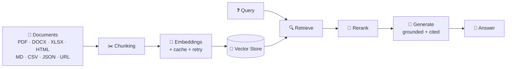

<div align="center">


# RAGify

### Build production‑ready RAG applications in .NET — retrieval **and** generation — with one clean, fluent API.

[](https://www.nuget.org/packages/RAGify)
[](https://www.nuget.org/packages/RAGify)
[](https://dotnet.microsoft.com/download)
[](LICENSE)
[](#-contributing)

**Ingest → Chunk → Embed → Store → Retrieve → Rerank → Generate** — every stage swappable, every provider pluggable.

[**Quick Start**](#-quick-start) · [**Features**](#-features) · [**Providers**](#-providers) · [**Generation**](#-answer-generation) · [**Examples**](#-examples) · [**Docs**](#-documentation)

</div>

---

## ✨ Why RAGify?

RAGify is a modular, clean‑architecture framework that turns the full Retrieval‑Augmented Generation pipeline into a few lines of fluent C#. It is **the complete loop** — not just retrieval — so you can go from raw documents to a grounded, cited answer without gluing five libraries together.

- 🔌 **Provider‑agnostic** — 8 embedding providers, 5 vector stores, 4 LLM providers, 2 rerankers. Swap any of them by changing one line.
- 🧠 **The "G" in RAG, built in** — generate grounded, cited answers with OpenAI, Azure OpenAI, Anthropic (Claude), or local Ollama. Streaming included.
- 🧩 **Clean Architecture** — small, focused interfaces (`IEmbeddingProvider`, `IVectorStore`, `IReranker`, `ILlmProvider`, …) you can implement yourself.
- ⚡ **Production‑minded** — embedding cache, retry/backoff, batching, metadata filtering, deduplication, dynamic Top‑K, and first‑class logging.
- 🏗️ **DI‑ready** — `services.AddRagify(...)` and you're wired into ASP.NET Core.
- 🎯 **One package, batteries included** — `dotnet add package RAGify` gives you everything; individual modules are also published for fine‑grained use.


```mermaid
flowchart LR
    A[📄 Documents<br/>PDF · DOCX · XLSX · HTML<br/>MD · CSV · JSON · URL] --> B[✂️ Chunking]
    B --> C[🔢 Embeddings<br/>+ cache + retry]
    C --> D[(💾 Vector Store)]
    Q[❓ Query] --> E[🔍 Retrieve]
    D --> E
    E --> F[🥇 Rerank]
    F --> G[🤖 Generate<br/>grounded + cited]
    G --> R[💬 Answer]
```

---

## 📋 Table of Contents

- [Features](#-features)
- [Installation](#-installation)
- [Quick Start](#-quick-start)
- [Answer Generation](#-answer-generation)
- [Providers](#-providers)
- [Chunking Strategies](#-chunking-strategies)
- [Document Ingestion](#-document-ingestion)
- [Reranking](#-reranking)
- [Embedding Cache & Resilience](#-embedding-cache--resilience)
- [Dependency Injection](#-dependency-injection)
- [Configuration](#-configuration)
- [Examples](#-examples)
- [Documentation](#-documentation)
- [Best Practices](#-best-practices)
- [Troubleshooting](#-troubleshooting)
- [Roadmap](#-roadmap)
- [Contributing](#-contributing)
- [License](#-license)

---

## 🚀 Features

| Stage | What you get |
|-------|--------------|
| 🗂️ **Ingestion** | PDF, Word (.docx), Excel (.xlsx), HTML, **Markdown**, **CSV/TSV**, **JSON/JSONL**, plain text, and **web pages by URL**. Files, streams, or raw text. |
| ✂️ **Chunking** | Fixed‑size, Sentence‑aware, Sliding‑window, **Recursive**, **Markdown‑aware**, and **Token‑aware** strategies — all configurable and extensible. |
| 🔢 **Embeddings** | 8 providers: OpenAI, Azure OpenAI, Ollama, ONNX, Hugging Face, Cohere, VoyageAI, Google Gemini. Async + batch, auto‑normalized. |
| 💾 **Vector Stores** | 5 stores: In‑Memory, Qdrant, PgVector, Pinecone, Weaviate. Metadata filtering, Top‑K, thresholds, batch ops. |
| 🔍 **Retrieval** | Query‑type detection, dynamic Top‑K, multi‑signal deduplication, low‑value filtering, similarity thresholds. |
| 🥇 **Reranking** | Cohere Rerank API + a dependency‑free local BM25 lexical reranker. Pluggable via `IReranker`. |
| 🤖 **Generation** | Grounded, **cited** answers via OpenAI, Azure OpenAI, Anthropic (Claude), or Ollama — with **token‑by‑token streaming**. |
| ⚡ **Performance** | Embedding cache, HTTP retry/backoff (429/5xx + `Retry-After`), automatic sub‑batching. |
| 🧩 **Hosting** | `AddRagify(...)` for `Microsoft.Extensions.DependencyInjection`, plus full `ILogger` support. |

---

## 📦 Installation

```bash
# Everything in one package (recommended) — includes generation, reranking, caching & DI
dotnet add package RAGify
```

> **Prefer fine‑grained packages?** The core modules are published separately too:
> `RAGify.Abstractions` · `RAGify.Core` · `RAGify.Ingestion` · `RAGify.Chunking` · `RAGify.Embeddings` · `RAGify.VectorStores` · `RAGify.Retrieval`

**Requirements:** .NET 10.0+ · Windows, Linux, or macOS · (optional) [Ollama](https://ollama.ai) for local models · ONNX Runtime is included automatically.

---

## ⚡ Quick Start

### Full RAG — retrieve **and** generate a grounded answer

```csharp
using RAGify;
using RAGify.Core;

var rag = new RagifyConfig()
    .WithChunking(ChunkingStrategyType.SentenceAware)
    .WithOpenAIEmbeddings("your-openai-key", "text-embedding-3-small")
    .WithInMemoryVectorStore()
    .WithOpenAIChat("your-openai-key", model: "gpt-4o-mini")   // 👈 the "G" in RAG
    .Build();

// Ingest knowledge
await rag.IngestAsync(Document.FromText(
    "RAGify is a modular .NET framework for Retrieval-Augmented Generation...",
    documentId: "doc-1", source: "intro"));

// Ask a question → get a grounded, cited answer
var result = await rag.AnswerAsync("What is RAGify?");

Console.WriteLine(result.Answer);                 // 💬 natural-language answer
Console.WriteLine($"Model: {result.Generation?.Model}");
foreach (var ctx in result.Context)              // 📚 the sources it was grounded in
    Console.WriteLine($"  [{ctx.Similarity:F3}] {ctx.Source}");
```

### 100% local — no API keys (Ollama)

```csharp
var rag = new RagifyConfig()
    .WithChunking(ChunkingStrategyType.SentenceAware)
    .WithOllamaEmbeddings("all-minilm")     // local embeddings
    .WithInMemoryVectorStore()
    .WithOllamaChat("llama3.2")             // local generation
    .Build();
```

### Retrieval only (no LLM)

```csharp
var result = await rag.QueryAsync("What is the main topic?");
foreach (var ctx in result.Context)
    Console.WriteLine($"[{ctx.Similarity:F3}] {ctx.Chunk.Text}");
```

---

## 🤖 Answer Generation

RAGify completes the RAG loop. Configure any `ILlmProvider` and call `AnswerAsync` for a grounded answer or `StreamAnswerAsync` for streaming.

```csharp
// Pick a chat provider
.WithOpenAIChat("key", model: "gpt-4o-mini")
.WithAzureOpenAIChat("key", deploymentName: "gpt-4o", resourceName: "your-resource")
.WithAnthropicChat("key", model: "claude-opus-4-8")   // Claude
.WithOllamaChat("llama3.2")                            // local
.WithLlm(myCustomLlmProvider)                          // your own ILlmProvider
```

**Stream tokens** as they're generated:

```csharp
await foreach (var token in rag.StreamAnswerAsync("Explain RAGify in detail"))
    Console.Write(token);
```

**Customize** the system prompt, temperature, and citations:

```csharp
var result = await rag.AnswerAsync("What is RAGify?", new QueryOptions
{
    Generation = new GenerationOptions
    {
        SystemPrompt   = "You are a concise technical assistant. Cite sources as [n].",
        Temperature    = 0.1,
        MaxTokens      = 500,
        IncludeCitations = true
        // PromptTemplate = "Context:\n{context}\n\nQ: {query}"   // or fully override the prompt
    }
});
```

> `QueryResult` exposes `Answer`, `Generation` (model + token usage), and the retrieved `Context`, so you always know exactly what grounded the answer.

---

## 🔌 Providers

### 🔢 Embedding Providers (8)

| Provider | Example models | Best for |
|----------|----------------|----------|
| **OpenAI** | `text-embedding-3-small/large`, `ada-002` | High accuracy, production |
| **Azure OpenAI** | All OpenAI models via Azure | Enterprise / compliance |
| **Ollama** | `nomic-embed-text`, `all-minilm` | Local, privacy‑sensitive |
| **ONNX** | Any ONNX SentenceTransformer | Offline, cost‑free inference |
| **Hugging Face** | 1000+ Inference API models | Research / experimentation |
| **Cohere** | `embed-english-v3.0`, multilingual | Multilingual apps |
| **VoyageAI** | `voyage-large-2`, `voyage-code-2` | Code & specialized tasks |
| **Google Gemini** | `text-embedding-004` | Google Cloud integrations |

<details>
<summary><b>Configuration snippets for each embedding provider</b></summary>

```csharp
.WithOpenAIEmbeddings(apiKey: "key", model: "text-embedding-3-small", dimension: 1536)
.WithAzureOpenAIEmbeddings(apiKey: "key", deploymentName: "text-embedding-ada-002",
                           resourceName: "your-resource", apiVersion: "2024-02-15-preview")
.WithOllamaEmbeddings(model: "all-minilm", baseUrl: "http://localhost:11434")
.WithOnnxEmbeddings(modelPath: "model.onnx", dimension: 384)
.WithHuggingFaceEmbeddings(apiKey: "hf-token", modelId: "sentence-transformers/all-MiniLM-L6-v2")
.WithCohereEmbeddings(apiKey: "key", model: "embed-english-v3.0", inputType: "search_document")
.WithVoyageAIEmbeddings(apiKey: "key", model: "voyage-large-2")
.WithGoogleGeminiEmbeddings(apiKey: "key", model: "text-embedding-004")
```

</details>

### 💾 Vector Stores (5)

| Store | Type | Best for |
|-------|------|----------|
| **In‑Memory** | Local | Dev, testing, < 100K vectors |
| **Qdrant** | Open‑source | High‑performance, self‑hosted, scales to billions |
| **PgVector** | PostgreSQL ext. | Existing Postgres infra, small–medium datasets |
| **Pinecone** | Managed cloud | Fully managed, serverless, auto‑scaling |
| **Weaviate** | Open‑source/cloud | Hybrid search, flexible schema |

<details>
<summary><b>Configuration snippets for each vector store</b></summary>

```csharp
.WithInMemoryVectorStore()
.WithQdrantVectorStore(host: "localhost", port: 6333, collectionName: "ragify", vectorSize: 1536)
.WithPgVectorStore(connectionString: "Host=localhost;Database=ragify;Username=postgres;Password=pwd",
                   tableName: "ragify_vectors", vectorSize: 1536)
.WithPineconeVectorStore(apiKey: "key", indexName: "ragify-index", environment: "us-east-1-aws")
.WithWeaviateVectorStore(baseUrl: "http://localhost:8080", className: "RAGifyVector")
```

You can also pass any custom `IVectorStore` via `.WithVectorStore(store)`. See [Configuration](#-configuration) for the full `PgVectorStoreOptions` (custom SQL, HNSW indexes, etc.).

</details>

### 🤖 LLM Providers (4) · 🥇 Rerankers (2)

| LLM (generation) | Reranker |
|------------------|----------|
| OpenAI · Azure OpenAI · Anthropic (Claude) · Ollama | Cohere Rerank · Local BM25 lexical |

---

## ✂️ Chunking Strategies

| Strategy | `ChunkingStrategyType` | Description |
|----------|------------------------|-------------|
| Fixed Size | `FixedSize` | Character windows with configurable overlap |
| Sentence‑Aware | `SentenceAware` | Respects sentence boundaries (keeps punctuation) |
| Sliding Window | `SlidingWindow` | Overlapping windows for context preservation |
| **Recursive** | `Recursive` | Splits by paragraph → line → sentence → word to fit the size limit |
| **Markdown** | `Markdown` | Splits on headings, keeps code fences intact |
| **Token‑Aware** | `TokenAware` | Sizes chunks by estimated tokens (pluggable tokenizer) |

```csharp
.WithChunking(ChunkingStrategyType.Recursive, new ChunkingOptions
{
    ChunkSize = 1000,
    OverlapSize = 200,
    RespectSentenceBoundaries = true
})
```

---

## 🗂️ Document Ingestion

`WithDefaultExtractors()` handles **PDF, Word, Excel, HTML, Markdown, CSV/TSV, JSON/JSONL, and plain text**. Web pages are ingested by URL.

```csharp
var ingestion = DocumentIngestionService.CreateDefault();

var fromFile     = await ingestion.IngestFromFileAsync("report.pdf");
var fromMarkdown = await ingestion.IngestFromFileAsync("README.md");
var fromCsv      = await ingestion.IngestFromFileAsync("data.csv");
var fromWeb      = await ingestion.IngestFromUrlAsync("https://example.com/article");   // 🌐

await rag.IngestAsync(fromWeb);

// Batch ingestion
await rag.IngestBatchAsync(documents);
```

---

## 🥇 Reranking

Add a second‑stage reranker to refine result ordering after vector search:

```csharp
.WithCohereReranker("your-cohere-key")   // Cohere Rerank API
.WithLexicalReranker()                    // dependency-free local BM25 — great offline
.WithReranker(myCustomReranker)           // any IReranker
```

---

## ⚡ Embedding Cache & Resilience

Cut API cost/latency and harden network calls:

```csharp
using RAGify.Embeddings;

var rag = new RagifyConfig()
    .WithChunking(ChunkingStrategyType.SentenceAware)
    .WithOpenAIEmbeddings("key", "text-embedding-3-small",
        httpClient: ResilientHttpClientFactory.Create(maxRetries: 3)) // retry 429/5xx + Retry-After
    .WithInMemoryEmbeddingCache(maxEntries: 100_000)                  // skip re-embedding duplicates
    .WithInMemoryVectorStore()
    .Build();
```

Need provider‑side batch limits respected? Wrap any provider with `BatchingEmbeddingProvider`.

---

## 🧩 Dependency Injection

```csharp
using Microsoft.Extensions.DependencyInjection;

services.AddRagify(cfg => cfg
    .WithChunking(ChunkingStrategyType.SentenceAware)
    .WithOpenAIEmbeddings("key", "text-embedding-3-small")
    .WithInMemoryVectorStore()
    .WithOpenAIChat("key"));

// Inject anywhere
public class SearchService(IRagify rag)
{
    public Task<QueryResult> Ask(string q) => rag.AnswerAsync(q);
}
```

---

## ⚙️ Configuration

<details>
<summary><b>Chunking options</b></summary>

```csharp
new ChunkingOptions
{
    ChunkSize = 1000,                 // max chunk size in characters (or tokens for TokenAware)
    OverlapSize = 200,                // overlap between chunks
    RespectSentenceBoundaries = true,
    RespectTokenBoundaries = false,
    MaxSentencesPerChunk = 5
}
```

**Recommendations:** general text `1000–1500 / 200–300`; code `500–800 / 100–150`. Use `SentenceAware`/`Recursive` for prose, `Markdown` for docs, `TokenAware` to respect model token limits.

</details>

<details>
<summary><b>Retrieval options</b></summary>

```csharp
new RetrievalOptions
{
    TopK = 5,                    // 0 = dynamic Top-K based on question type
    SimilarityThreshold = 0.7,   // 0.0–1.0  (0.5–0.7 is a good default)
    EnableDynamicTopK = true,
    EnableDeduplication = true,
    Filter = new MetadataFilter
    {
        Filters = new() { ["Category"] = "Technical", ["Year"] = 2024 }
    }
}
```

</details>

<details>
<summary><b>PgVector — custom SQL, HNSW indexes & more</b></summary>

`PgVectorStoreOptions` lets you override every SQL statement (`SearchQuery`, `UpsertQuery`, `CreateIndexQuery`, `FilterConditionTemplate`, …) using placeholders `{tableName}`, `{vectorSize}`, `{whereClause}`. Example HNSW index:

```csharp
var options = new PgVectorStoreOptions
{
    CreateIndexQuery = @"CREATE INDEX IF NOT EXISTS {tableName}_embedding_idx
        ON {tableName} USING hnsw (embedding vector_cosine_ops) WITH (m = 16, ef_construction = 64)"
};
.WithPgVectorStore("connection-string", "ragify_vectors", 1536, options)
```

</details>

<details>
<summary><b>Logging</b></summary>

RAGify integrates with `Microsoft.Extensions.Logging`. Pass a logger to surface ingestion, chunking, embedding, storage, retrieval, and generation activity:

```csharp
var loggerFactory = LoggerFactory.Create(b => b.AddConsole().SetMinimumLevel(LogLevel.Information));
var rag = new RagifyConfig()
    /* ... */
    .WithLogger(loggerFactory.CreateLogger<Ragify>())
    .Build();
```

Use `Information` in production, `Debug` while diagnosing. Logging is optional.

</details>

---

## 💡 Examples

<details>
<summary><b>Ingest files from a folder & query with metadata filtering</b></summary>

```csharp
var ingestion = DocumentIngestionService.CreateDefault();
var docs = new List<IDocument>();
foreach (var path in Directory.GetFiles("documents/", "*.pdf"))
    docs.Add(await ingestion.IngestFromFileAsync(path,
        metadata: new() { ["Category"] = "Technical" }));

await rag.IngestBatchAsync(docs);

var result = await rag.AnswerAsync("What is machine learning?", new QueryOptions
{
    Retrieval = new RetrievalOptions
    {
        TopK = 10,
        SimilarityThreshold = 0.7,
        Filter = new MetadataFilter { Filters = new() { ["Category"] = "Technical" } }
    }
});
```

</details>

<details>
<summary><b>Self-hosted, cost-efficient stack (Qdrant + Cohere rerank + Claude)</b></summary>

```csharp
var rag = new RagifyConfig()
    .WithChunking(ChunkingStrategyType.Recursive)
    .WithOpenAIEmbeddings("openai-key", "text-embedding-3-small")
    .WithQdrantVectorStore(host: "localhost", port: 6333, collectionName: "kb", vectorSize: 1536)
    .WithCohereReranker("cohere-key")
    .WithAnthropicChat("anthropic-key", model: "claude-opus-4-8")
    .WithInMemoryEmbeddingCache()
    .Build();
```

</details>

---

## 📚 Documentation

### Architecture

RAGify follows Clean Architecture as a set of NuGet‑ready libraries:

```
RAGify.sln
├── src/
│   ├── RAGify.Abstractions   # Interfaces & contracts (no dependencies)
│   ├── RAGify.Core           # Domain models & utilities (VectorMath, TextCleanup)
│   ├── RAGify                # Main package — orchestrator, builder, generation, reranking, DI
│   ├── RAGify.Ingestion      # Document extractors (PDF/Word/Excel/HTML/MD/CSV/JSON/Web)
│   ├── RAGify.Chunking       # Chunking strategies
│   ├── RAGify.Embeddings     # 8 embedding providers + cache/resilience/batching
│   ├── RAGify.VectorStores   # 5 vector stores
│   └── RAGify.Retrieval      # Retrieval engine (+ reranking hook)
└── test/
    ├── RAGify.ConsoleTest    # Interactive console harness
    └── RAGify.Tests          # Unit & integration test suite
```

**Dependency flow:** `Abstractions ← Core ← {Ingestion, Chunking, Embeddings, VectorStores, Retrieval} ← RAGify`.

### Extending RAGify

Every stage is an interface — implement and plug in your own:

| Interface | Implement to add… |
|-----------|-------------------|
| `IDocumentExtractor` | a new file format |
| `IChunkingStrategy` | a custom chunking algorithm |
| `IEmbeddingProvider` | a new embedding backend |
| `IVectorStore` | a new vector database |
| `IReranker` | a custom reranking model |
| `ILlmProvider` | a new chat/LLM backend |
| `IEmbeddingCache` | a distributed cache (Redis, etc.) |

```csharp
var rag = new RagifyConfig()
    .WithEmbeddings(new MyEmbeddingProvider())
    .WithVectorStore(new MyVectorStore())
    .WithReranker(new MyReranker())
    .WithLlm(new MyLlmProvider())
    .Build();
```

### Console Test App

```bash
ollama pull all-minilm:latest    # if using Ollama
dotnet run --project test/RAGify.ConsoleTest
```

Interactive harness for ingesting files/text, browsing chunks, querying, and tuning Top‑K / thresholds at runtime, with live logging.

---

## 🎯 Best Practices

- **Chunking:** balance size vs. relevance; use overlap to preserve context; match your embedding model's optimal input length.
- **Embeddings:** enable the cache for repeated content; choose local (Ollama/ONNX) vs. cloud per privacy/cost; use a resilient `HttpClient` in production.
- **Vector stores:** In‑Memory for dev; PgVector/Qdrant for self‑hosted; Pinecone for fully managed. Index properly (HNSW for large datasets) and use metadata filters to narrow scope.
- **Retrieval & generation:** start with Top‑K 5–10 and threshold 0.5–0.7; add a reranker for precision; keep `Temperature` low (0.0–0.2) for factual answers and rely on citations.
- **Security:** keep API keys in environment variables/secret stores; use HTTPS and auth for remote stores.

---

## 🐛 Troubleshooting

| Issue | Fix |
|-------|-----|
| `No extractor found for file` | Use `WithDefaultExtractors()` or add a custom `IDocumentExtractor`. |
| Ollama connection errors | Ensure Ollama is running and the model is pulled (`ollama pull <model>`); check the base URL. |
| Low similarity scores | Lower the threshold (0.5–0.7), increase overlap, verify the embedding provider, ensure vectors are normalized. |
| `AnswerAsync` throws `InvalidOperationException` | Configure an LLM with `WithOpenAIChat()/WithAnthropicChat()/WithOllamaChat()/WithLlm()`. |
| PgVector query errors | Install the extension (`CREATE EXTENSION vector;`) and match vector dimensions to your model. |
| Memory issues on large datasets | Use a persistent vector store, smaller batches, and an HNSW index. |

---

## 🗺️ Roadmap

- [ ] Hybrid (keyword + vector) search
- [ ] Conversation / chat memory
- [ ] Built‑in evaluation metrics (precision / recall / nDCG / faithfulness)
- [ ] More providers (Mistral, Jina, Bedrock) and stores (Redis, Milvus, Azure AI Search)
- [ ] OpenTelemetry metrics & tracing

Have an idea? [Open an issue](https://github.com/FarhanLodi/RAGify/issues) or a PR. ⭐ the repo to follow along.

---

## 🤝 Contributing

Contributions are welcome!

1. Fork & create a feature branch: `git checkout -b feature/amazing-feature`
2. Follow the existing style (file‑scoped namespaces, XML docs, one class per file, `Models/` folders)
3. Add tests for new behavior
4. Update the README/docs
5. Open a PR with a clear description

---

## 📄 License

Licensed under the **MIT License** — see [LICENSE](LICENSE).

## 🙏 Acknowledgments

Built with [.NET](https://dotnet.microsoft.com/), inspired by modern RAG architectures, and thankful to every embedding/LLM provider team for their excellent APIs.

## 💖 Support

If RAGify saves you time, consider supporting development:

💳 **PayPal** — [paypal.me/FarhanLodi](https://paypal.me/FarhanLodi) · 📱 **UPI (India)** — `farhanlodi5@oksbi`

<div align="center">

---

**Made with ❤️ for the .NET community** — if this helped you, please ⭐ the repo!

</div>
